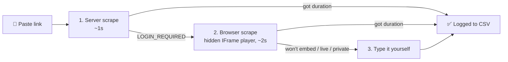

<div align="center">

# 🎧 Immersion Tracker

**Paste a YouTube link → its duration is appended to a CSV.**
The CSV *is* the database. No API keys, no accounts, no dependencies.

[](https://nodejs.org)
[](#)
[](#%EF%B8%8F-the-database)
[](#-getting-durations--no-api-key)
[](#-quick-start)

🇩🇪 **German** · 🇯🇵 **Japanese** · 🇪🇸 **Spanish** — three fully separate trackers

</div>

---

## ⚡ Quick start

```bash
node server.js
```

Or just double-click **`start.bat`**. Then open **<http://localhost:4545>**.

> [!TIP]
> Node 18+ is the only requirement. No `npm install`, no build step.
>
> *"Port already in use"* simply means the tracker is **already running** — open the link.
> To run a second copy alongside it: `set PORT=4546 && node server.js`

---

## ✨ What it does

| | |
| :-- | :-- |
| 🔗 **Paste & log** | Drop in a YouTube URL — title, channel and exact duration are fetched automatically |
| 🌍 **Three languages** | German, Japanese and Spanish, each with its own log, goal, baseline, level and streak |
| 🎯 **Daily goal** | A bar across the top turns green the moment you hit today's minutes |
| 📈 **Dashboard** | Total · today · last 7 days (with daily average) · current day-streak · 14-day bar chart |
| 🏆 **Levels** | A 7-step roadmap from *"starting from zero"* to *"effective for all practical purposes"* |
| 🗄️ **Plain CSV** | Openable in Excel or Sheets, editable by hand, re-read on every request |
| 🔒 **Local-first** | Nothing leaves your machine except the YouTube lookups themselves |

---

## 🌍 Languages

Pick one from the flag menu in the header. Each language is an **independent tracker** —
nothing is shared or summed across them.

| | Language | Log file |
| :-: | :-- | :-- |
| 🇩🇪 | German | `data/immersion_log_de.csv` |
| 🇯🇵 | Japanese | `data/immersion_log_ja.csv` |
| 🇪🇸 | Spanish | `data/immersion_log_es.csv` |

The active flag appears beside every mention of the language — header, picker, *Overall
progression*, *Levels*, *Immersion log*, the footer and the browser tab icon.

Your choice is remembered between visits, and `?lang=de` / `?lang=ja` / `?lang=es` opens a
specific tracker directly — handy for bookmarks.

<details>
<summary>🎨 <b>Why the flags are hand-drawn in CSS/SVG</b></summary>

<br>

Windows ships no flag glyphs, so 🇯🇵 renders as the bare letters "JP". The flags are drawn
as shapes instead, so they look the same on every platform.

</details>

<details>
<summary>⬆️ <b>Upgrading from the single-language version?</b></summary>

<br>

An existing `immersion_log.csv` is renamed to `immersion_log_de.csv` automatically on first
start, and the old daily goal carries over to German. Nothing to do by hand.

</details>

---

## 🗄️ The database

`data/immersion_log_<lang>.csv` — **one row per watch session, append-only.**

<details>
<summary><b>Column reference</b> (click to expand)</summary>

<br>

| Column | Meaning |
| :-- | :-- |
| `entry_id` | Internal id (used to delete a row) |
| `kind` | `video`, or `baseline` for the pre-tracking carry-over |
| `date` | Date you watched it (`YYYY-MM-DD`) — empty for the baseline |
| `url` | Canonical YouTube link |
| `video_id` | 11-character YouTube id |
| `title` | Video title |
| `channel` | Channel name |
| `duration_seconds` | Length in seconds (exact) |
| `duration_hours` | Same value in hours, 4 dp |
| `logged_at` | When the row was written |

</details>

> [!IMPORTANT]
> **Duplicates are intentional.** Watching the same video twice writes two rows and counts
> twice. The log shows a `×N` badge so you can see how often a video repeats, but every
> row's hours are counted separately.

The file is properly quoted RFC 4180 — open it in Excel or Sheets any time. Editing it by
hand is fine; the app re-reads it on every request.

> [!NOTE]
> `data/` is **gitignored** by default, since it holds your personal log. Drop the top lines
> from [`.gitignore`](.gitignore) if you would rather keep it backed up in the repo.

---

## 📊 Dashboard

All figures are in **hours**.

### 🎯 Daily goal

A bar across the top shows today's minutes against your goal, turning green once you hit it.
Click the number or the ✏️ to change it — **Enter** saves, **Escape** cancels. Each language
keeps its own goal in `data/settings.json` (preferences, not immersion data, so they stay
out of the CSVs).

### 🏆 Levels

A seven-level roadmap based on hours of comprehensible input:

| Level | Hours | Known words | What it feels like |
| :-: | --: | --: | :-- |
| 1️⃣ | 0 | 0 | Starting from zero. |
| 2️⃣ | 50 | 300 | You know some common words. |
| 3️⃣ | 150 | 1,500 | You can follow topics adapted for learners. |
| 4️⃣ | 300 | 3,000 | You can understand a person speaking to you patiently. |
| 5️⃣ | 600 | 5,000 | You can understand native speakers speaking to you normally. |
| 6️⃣ | 1,000 | 7,000 | You are comfortable with daily conversation. |
| 7️⃣ | 1,500 | 12,000+ | You can use the language effectively for all practical purposes. |

***Overall progression*** shows which level you're in, a bar filling from the current
level's threshold to the next, and the hours still to go. Each locked level estimates when
you'll reach it:

```text
days remaining = ceil( (threshold − total hours) ÷ daily goal )
```

Known-word counts are descriptive only — the app tracks **hours**, not vocabulary.

***Statistics*** counts **hours watched** (logged videos, excluding the baseline),
**watched videos**, and **days you practiced** (distinct dates in the log).

---

## ⚑ Baseline

Hours immersed *before* you started tracking. It is a single row in the CSV
(`kind=baseline`), so **the total is always just the sum of the file** — nothing is hidden
in a side config.

Because it carries no date, it is invisible to *Today*, *Last 7 days*, the streak and the
chart. It only moves the total.

* German is currently set to **14 h 31 min**; Japanese and Spanish start at zero.
* Change it with **⚑ Set starting baseline** under the link box — the field pre-fills with
  the current value, and saving **replaces** the row rather than adding another.
* Set it to zero to remove it entirely.

---

## 🔍 Getting durations — no API key

Everything is scraped. Three steps, and you rarely see past the first two:



<table>
<tr><td width="32%">

**1️⃣ Server-side scrape**
*~1s*

</td><td>

The oEmbed endpoint gives the title and channel reliably; the watch page gives the duration
*when YouTube feels like it*. For a lot of videos it answers `LOGIN_REQUIRED` instead,
because a bare server request looks like a bot. Every InnerTube client (`ANDROID`,
`ANDROID_VR`, `IOS`, `MWEB`, `TVHTML5`, embedded players) hits the same wall — there is no
server-only fix.

</td></tr>
<tr><td>

**2️⃣ Browser-side scrape**
*~2s*

</td><td>

If step 1 got no duration, the page spins up a **muted, offscreen YouTube IFrame player**
and reads `getDuration()` off it. That iframe runs on youtube.com's own origin inside *your*
browser, so YouTube treats it as a normal viewer and answers. This rescues essentially every
video the server can't resolve. Nothing plays or is heard — the player is muted, offscreen
and destroyed immediately.

</td></tr>
<tr><td>

**3️⃣ Manual entry**

</td><td>

Only reachable if a video refuses to embed at all (`101`/`150`), is private/deleted, or is a
live stream with no fixed length. A box opens pre-filled with the title for you to type
hours / minutes / seconds.

</td></tr>
</table>

> [!TIP]
> You can open that box yourself with **⌨ Enter the duration myself** — use it when you only
> watched *part* of a long video, since what you're tracking is hours immersed, not video
> length.

---

## ⚙️ Options

| Variable | Default | Purpose |
| :-- | :-- | :-- |
| `PORT` | `4545` | Port the server listens on |
| `DATA_DIR` | `data/` | Holds every CSV plus `settings.json` |

---

## 🗂️ Project layout

```text
.
├── server.js        # zero-dependency Node server + CSV I/O + YouTube scraping
├── start.bat        # double-click launcher (opens the browser, then starts the server)
├── public/
│   ├── index.html   # the whole UI
│   ├── app.js       # dashboard, IFrame duration fallback, language switching
│   └── styles.css   # incl. the hand-drawn CSS/SVG flags
└── data/            # gitignored — your CSVs and settings.json live here
```

<div align="center">
<br>

*Every hour counted.* 🇩🇪 🇯🇵 🇪🇸

</div>
